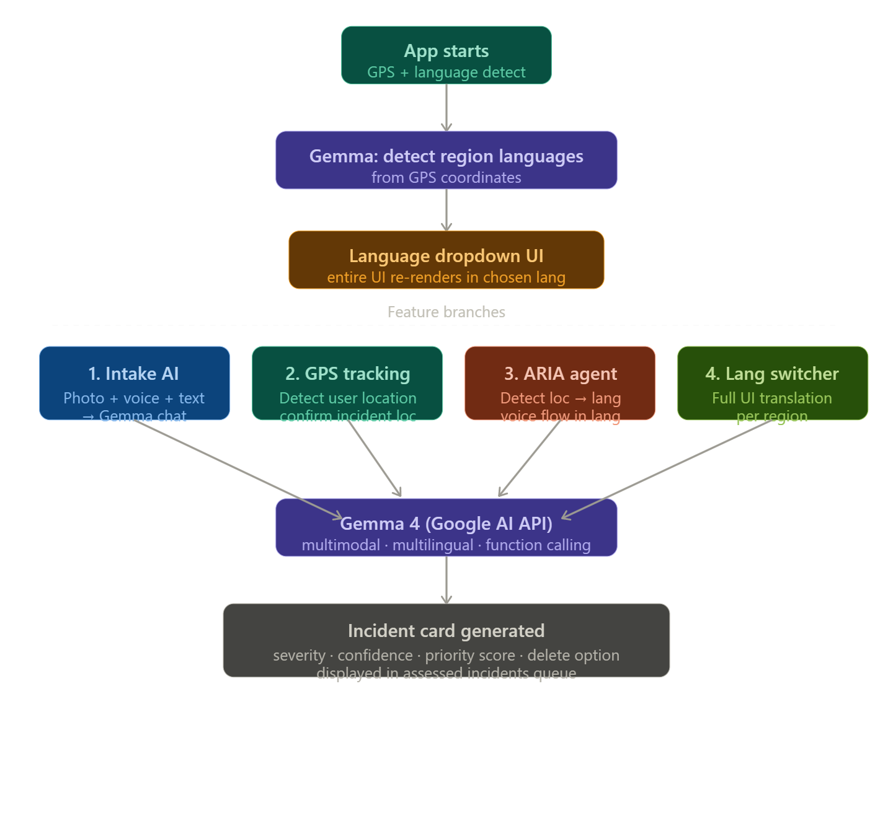

here I'm planning few things 1)here the visual intake sensor,acoustic uplink and text description in report an incident seems to be just a show for demo but I want it to be functional with gemma 4 model how I want it is that it should use gemma model and that gemma model must scan the uploaded image and infer what has happened and then when the person speaks also the gemma model should listen or if they type it should act like a chatbot and ask relevant questions to make it as an incident card and as usual perform priority and confidence score operations and then after that it will be seen as incident card below in the assessed incident area... also there should be an option to delete the incident by the same person who created it 2)When the user enters the application the gps should be enabled to track their location and this information should be utilized later by the model asking the user the incident you are asking about is in the same location or any other location if yes please specify... It should allow all languages as gemma model is capable of multi language support 3) ARIA agent should first detect the location and then it should go back to the ai model to detect what are the languages spoken in the particular region for eg: If tamilnadu ARIA should first ask Hello Tamil or English , 'English' is default if the user says tamil then it should proceed in tamil and then when the incident is spoken by the user it should be listened and transcribed to AI and the previous workflow of incident card generation from the incident described in voice by user should happen   4)Once in the start of application when the user location is detected the llm api model will analyse the languages available in that region and provide a drop down menu when the user selects a particular language the entire page should be changed to that language   
refer to below structural image for understanding
 refer